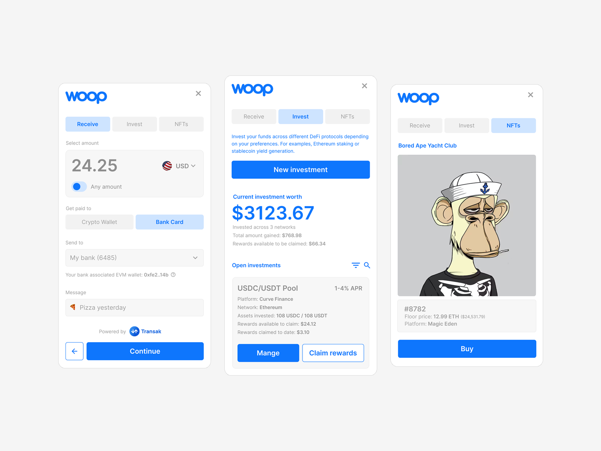

# Woop Widget UI

As part of improving my design engineering skills, I am developing the Woop Widget UI which I have already designed in Figma. 

This project has been built using:
- Next.js 15 with App Router
- Tailwind v4
- Shadcn components

## Design Reference 

These are the current basic designs. More functionality is needed, but my goal here is to build these screens using React.

